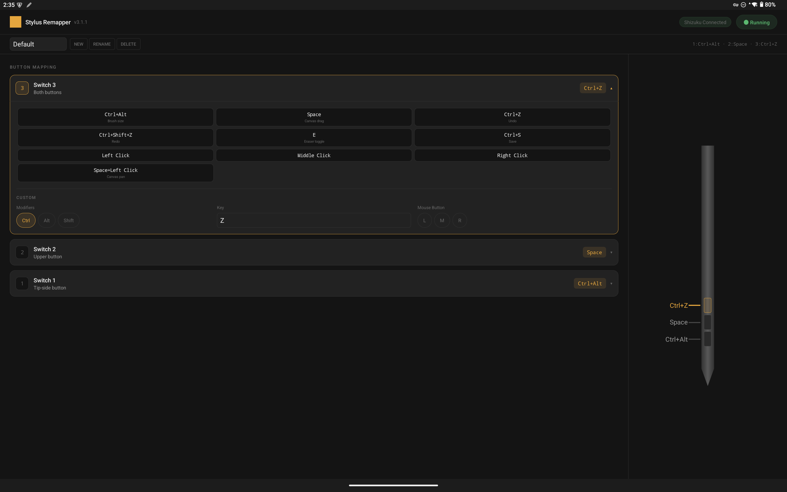

# Movinkpad Stylus Remapper

<p align="center">
  
</p>

**[日本語版はこちら](README.ja.md)**

An Android app that remaps the side buttons of the Wacom Pro Pen 3 on the MovinkPad Pro 14 to keyboard shortcuts and mouse clicks.

Designed for apps like CLIP STUDIO PAINT that lack native stylus button support on Android.

## Features

- **Keyboard shortcut mapping** — Any combination of modifiers (Ctrl, Alt, Shift) + a key
- **Mouse button mapping** — Left / Middle / Right click, or key+click combos (e.g. Left Click + Space for canvas panning)
- **Preset gallery** — One-tap selection of common mappings (Ctrl+Z, Space, Ctrl+Alt, etc.)
- **Profiles** — Save multiple named profiles and switch between them (e.g. ClipStudio, MediBang)
- **Notification** — Shows current profile name and key assignments in the status bar
- **Light / Dark mode** — Follows system theme automatically
- **i18n** — English and Japanese supported; add `values-XX/strings.xml` to contribute a new language
- **Screen rotation** — Mappings work correctly in any orientation
- **Palm rejection** — Only pen button events are captured; touch input is unaffected

### Default Mappings

| Switch | Position | Mapping | Use Case (CSP) |
|--------|----------|---------|----------------|
| Switch 1 | Tip side | Ctrl+Alt | Brush size |
| Switch 2 | Upper | Space | Canvas drag |
| Switch 3 | Both buttons | Ctrl+Z | Undo |

## Requirements

- Wacom MovinkPad Pro 14 (Android 14)
- [Shizuku](https://shizuku.rikka.app/) installed and running
- ADB connection for initial Shizuku setup only (wireless debugging or USB)

## Download

Download the APK from the [Releases page](https://github.com/KawaNae/Movinkpad-stylus-remapper/releases/latest).

## Setup

### 1. Prepare Shizuku

1. Install [Shizuku](https://shizuku.rikka.app/download/)
2. Start Shizuku using one of:
   - **Wireless debugging** (Android 11+): Developer options → Enable wireless debugging → Start from Shizuku app
   - **ADB**: Run `adb shell sh /sdcard/Android/data/moe.shizuku.privileged.api/start.sh` from a PC

### 2. Install the App

Download the APK from [Releases](https://github.com/KawaNae/Movinkpad-stylus-remapper/releases/latest) and install it.

To build from source:
```bash
./gradlew assembleDebug
adb install app/build/outputs/apk/debug/MovinkpadStylusRemapper-v3.1.1.apk
```

### 3. Usage

1. Make sure Shizuku is running
2. Open Stylus Remapper
3. Grant permission in the Shizuku dialog
4. The remapper starts automatically when connected — tap the status badge to start/stop

## How It Works

- Reads raw Linux input events (`input_event` structs) from `/dev/input/event*`
- Detects Pro Pen 3 side button presses (`EV_KEY`: `0x14b`, `0x14c`)
- Full proxy architecture: grabs the input device with `EVIOCGRAB`, re-injects all non-button events, and injects mapped key/mouse events via `InputManager.injectInputEvent()`
- Runs as a Shizuku UserService (ADB shell-level privileges)
- Native `libpengrab.so` handles the low-level `EVIOCGRAB` operations

## Project Structure

```
app/src/main/
├── aidl/.../IRemapperService.aidl     # IPC interface
├── cpp/pengrab.c                      # Native EVIOCGRAB helper
├── java/.../
│   ├── MainActivity.java              # UI (profiles, button config, start/stop)
│   ├── RemapperUserService.java       # Core logic (Shizuku privileged process)
│   ├── RemapperForegroundService.java # Persistent notification
│   ├── ShizukuHelper.java            # Shizuku permission & binding
│   ├── PenGrab.java                  # JNI bridge for libpengrab.so
│   ├── MappingPresets.java           # Preset definitions
│   ├── KeyDefinitions.java          # Key list & display name utilities
│   ├── ProfileManager.java          # Profile save/load
│   └── ButtonAction.java            # Mapping data model (Parcelable)
└── res/
    ├── layout/                       # UI layout
    ├── drawable/                     # Icons & backgrounds
    ├── values/                       # English strings, colors, themes
    ├── values-ja/                    # Japanese strings
    └── values-night/                 # Dark mode colors & themes
```

## Notes

- Shizuku must be restarted after each device reboot (unless rooted)
- Button event codes are based on the MovinkPad Pro 14 + Pro Pen 3. Other devices may use different codes
- All button mappings are fully customizable within the app

## Build Environment

- Android Studio
- compileSdk 34 / minSdk 26 / targetSdk 34
- Shizuku API 13.1.5
- Java 11
- CMake 3.22.1 (for native code)

## License

MIT
